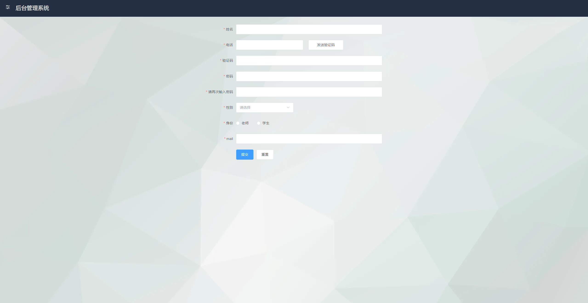
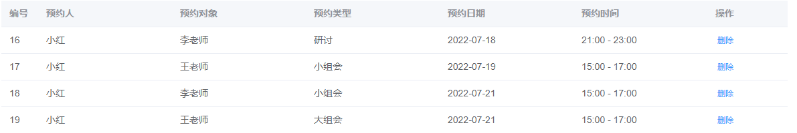
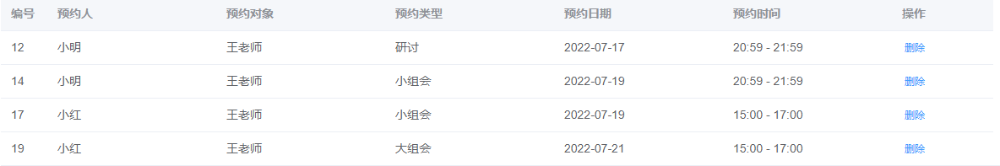
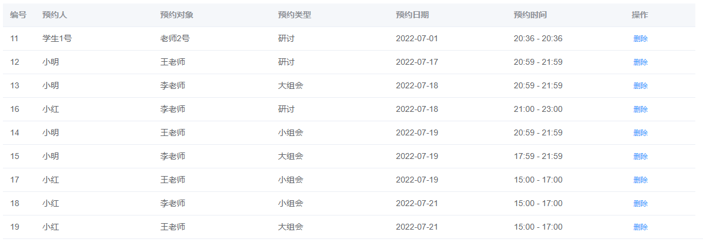

# 预约管理系统
本项目基于Vue3+ElementPlus开发前台，基于express+MySQL开发后台的预约管理系统，具有账号注册、验证码登录（提供模拟验证码与阿里云验证码接口）、jwt验证、信息修改等功能，所有数据储存于本地数据库中，请确保在运行环境内进行MySQL配置。

## 说明  
1、数据库配置文件位于server/util.dbconfig.js，接口文件位于server/routes文件夹中，路由回调函数位于server/controllers文件夹中；  
2、分别提供了模拟发送验证码（服务端控制台显示）和阿里云发送验证码（手机接收，需要申请服务密钥）接口；  
3、开发环境为nodeJs v16.13.12；  

## 技术栈
vue3 + vuex + vue-router + elementPlus + nodeJs + MySQL(navcat)

## 接口说明
express运行在3002接口上。
### 用户信息相关接口
1.  http://localhost:3002/login/codeFake  ->get请求，在服务端通过rand函数生成验证码进行验证，服务端使用Map将验证码保存起来进行验证，60秒后失效
2.  http://localhost:3002/login/codeFakeAli  ->get请求，使用阿里大鱼短信平台向手机发送真实验证短信（需要付费），服务端使用Map将验证码保存起来进行验证，60秒后失效
3.  http://localhost:3002/login/register  ->post请求，验证客户端发来的注册信息，如果数据库不存在则注册成功，如果数据库已存在该用户则返回失败
4.  http://localhost:3002/login/validate  ->post请求，验证客户端发送的验证码是否正确
5.  http://localhost:3002/login/getinfo ->get请求，在用户登录成功时向服务端发送身份信息的请求，用于页面渲染
6.  http://localhost:3002/login/revinfo  ->post请求，修改用户信息
### 预约相关接口
1.  http://localhost:3002/app/makeappoint  ->post请求，向数据库提交预约信息
2.  http://localhost:3002/app/getapplist  ->get请求，向数据库查询预约信息
3.  http://localhost:3002/app/delapplist  ->post请求，向数据库删除预约信息
4.  http://localhost:3002/app/getteacher  ->get请求，向数据库获取所有老师的信息，用于学生预约时选择老师


## 登录/注册界面



## 预约信息显示
学生只能看见预约人为自己的条目

老师只能看见预约对象为自己的条目

管理员能看所有条目


## 项目安装
```
npm install
```

### 项目编译
```
npm run serve 
```

### 项目构建
```
npm run build
```


